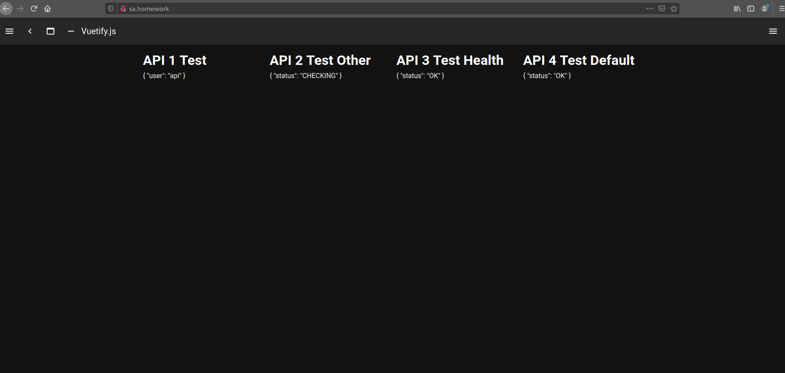

# Notes
This repo contains files for the homework. 

I had problems with how ingress is setup on the minikube. So I run this script to fix that. If you want to test it on your local environment then you have to run it as well.
```
kubectl delete -A ValidatingWebhookConfiguration ingress-nginx-admission
```

This is the end result. I configured kubernetes connected front to the back. You can see screenshot from the browser.

